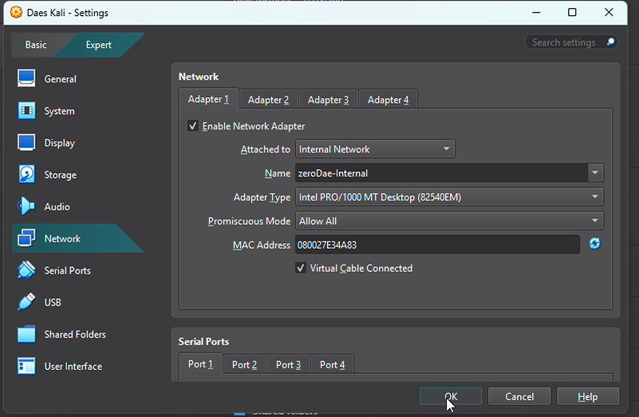
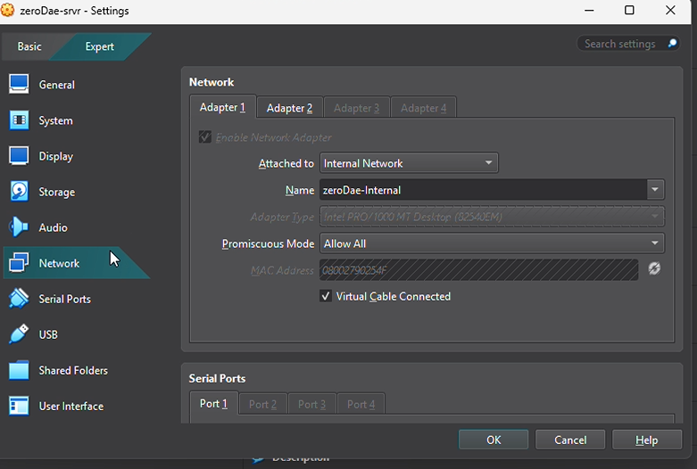
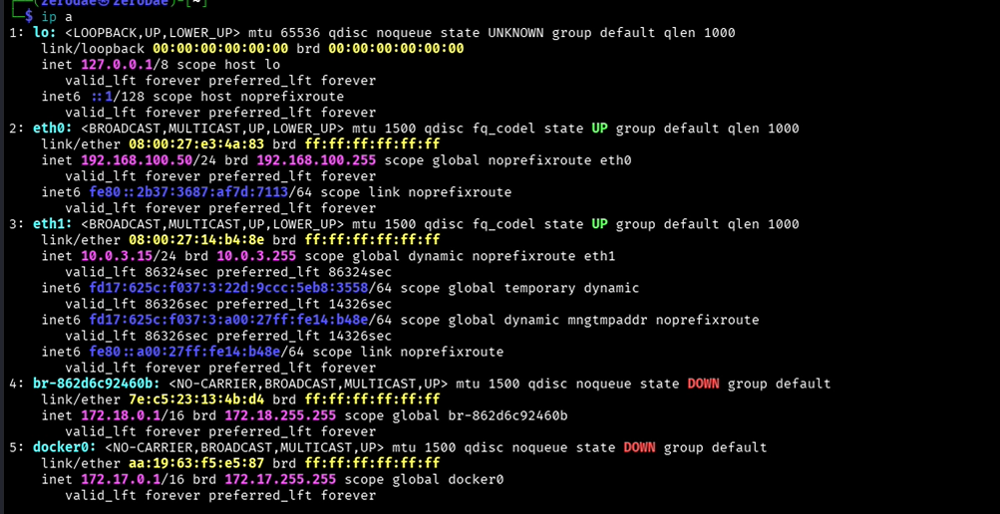
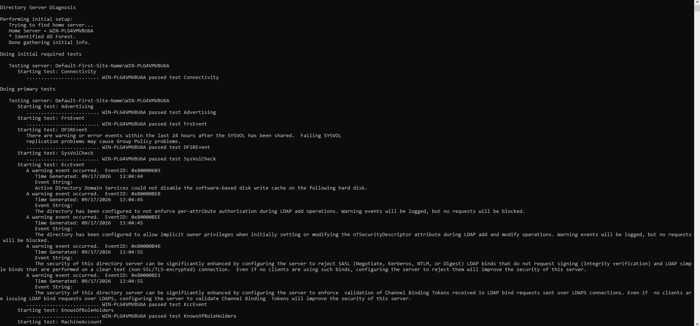
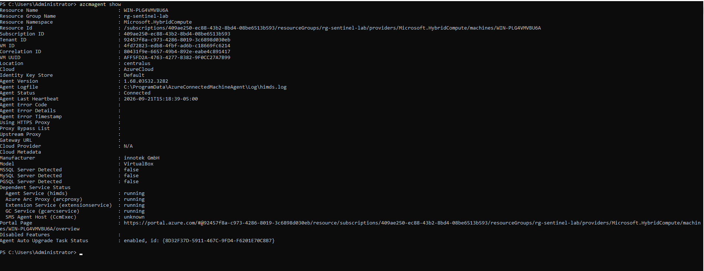
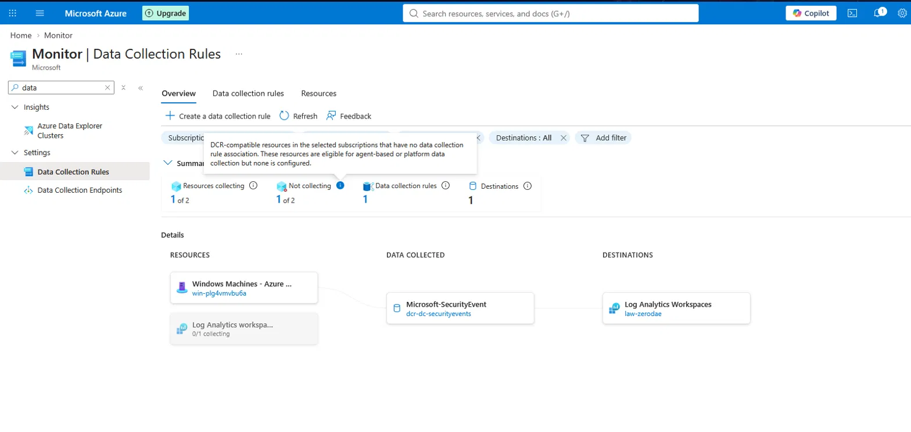
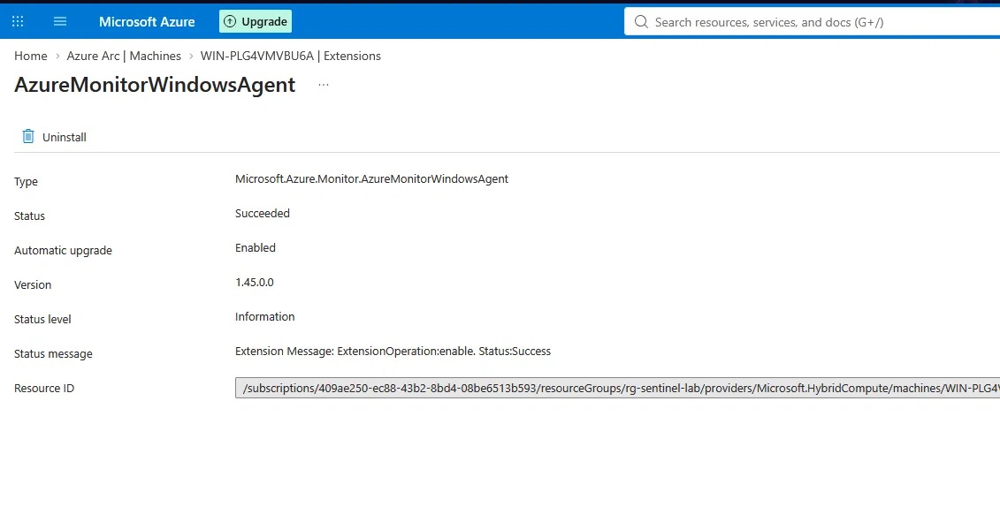
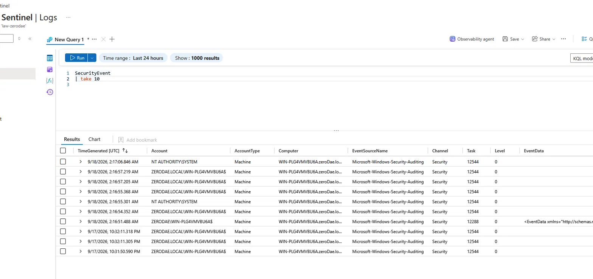
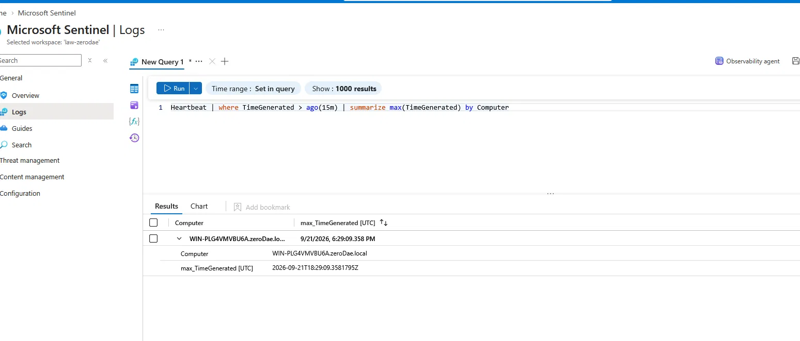

## Objective 

Ingest Windows Security telemetry from an on-premise Active Directory domain controller into a cloud SIEM (Microsoft Sentinel), establishing the detection foundation for later projects (brute-force detection, kerberoasting).

I connected my existing on-prem DC to Sentinel allowing me to demonstrate a hybrid on-prem -> cloud pipeline. This displays a more distinctive skill than an all-in0Azure deploy.

## Environment

| Component         | Detail                                                                                    |
| ----------------- | ----------------------------------------------------------------------------------------- |
| Domain Controller | Windows Server 2022 · `WIN-PLG4VMVBU6A` domain: `zeroDae.local`                           |
| Atatcker          | Kali Linux                                                                                |
| Cloud             | Azure Resource Group `rg-sentinel-lab` · Log Analytics `law-zerodae` · Microsoft Sentinel |
| DC networking     | Adapter1=Internal Network `zeroDae.local` (192.168.100.10) · Adapter 2 = NAT              |
| Kali networking   | eth0=Internal Network `zeroDae.local` (192.168.100.50) · eth1 = NAT                       |

## Steps completed 

### 1. Networking for Arc

- Both machines run dual NICs: an isolated Internal Network carries domain traffic between the DC and the attacker, while a NAT adapter provides the internet egress that Azure Arc requires. The Internal Network  has no DHCP, so both hosts use static addresses on the `192.168.100.0/24` segment.

	

	


- Domain Controller address (from `ipconfig /all`)

```powershell
IPv4 Address. . . . . . . . . . . : 192.168.100.10
Subnet Mask . . . . . . . . . . . : 255.255.255.0
DNS Servers . . . . . . . . . . . : 192.168.100.10
```




### 2. Domain Controller Health Check 

- Verified Active Directory services were healthy before onboarding, using `dcdiag`. All critical tests (Connectivity, Advertising, Replications, NetLogons, Services, KnowsOfRoleHolders) passed
	

### 3. Onboard the Domain Controller to Azure Arc

- Generated the onboarding script in the Azure portal (**Azure Arc → Machines → Add a single server → Generate script**), ran it in an elevated PowerShell session on the DC, and completed the device-login authentication. 
- Azure Arc projects the on-prem server into Azure as a managed resource, which is the prerequisite for installing the Azure Monitor Agent on a non-Azure machine.

	
	
	
```powershell
./Onboarding.ps1
```


Local confirmation with `azcmagent show`:
	
	
```powershell
Resource Name   : WIN-PLG4VMVBU6A
Agent Version   : 1.68.03532.3282
Agent Status    : Connected
```

### 4. Deploy the Azure Monitor Agent + Data Collection Rule

- Installed the **Windows Security Events** solution from the Content Hub, opened the **Windows Security Events via AMA** data connector, and created a Data Collection Rule (`dcr-dc-securityevents`) scoped to the Arc-enabled DC, collecting **All Security Events** into the `law-zerodae` workspace. 
- Adding the DC to the DCR automatically installs the Azure Monitor Agent on the box.

	
	

### 5. Enable Auditing (Group Policy)

- The DCR only collects events that Windows actually writes to the Security log, so the required audit subcategories must be enabled. To do this you can edit the **Default Domain Controllers Policy → Computer Configuration → Policies → Windows Settings → Security Settings → Advanced Audit Policy Configuration → Audit Policies**:
	- **Logon/Logoff → Audit Logon** — Success + Failure → _Event IDs 4624 / 4625_
	- **Account Logon → Audit Kerberos Service Ticket Operations** — Success + Failure → _Event ID 4769_
	- **Account Logon → Audit Kerberos Authentication Service** — Success + Failure → _Event IDs 4768 / 4771_

Applied with `gpupdate /force` on the DC.
	
	
	
	
### 6. Verify Telemetry Reaching Sentinel

- Confirmed events were flowing from the DC into the `SecurityEvent` table, and that the agent was reporting via `Heartbeat`.

	

	


## Conclusion

This completes the first inital steps to my SOC detection lab. Azure sentinel can now monitor all log data coming from the DC machine. What this means is i can now demonstrate purple team exercises simulating what a attack would look like from the attackers POV and the defenders POV and how it relates to real-world SOC environments. 
