## Objective 

Build a Hybrid SOC detection pipeline that streams Windows Security telemetry from an on-premesis Active Directory [[Domain Controller]] into Microsoft Sentinel, then simulate a real credential attack from an attacker host and detect it with a custom KQL analytics rule that raises a MITRE-mapped incident.

The value of this build is that the domain controller stays **on-premise** and is projected into the cloud SIEM via Azure Arc — a hybrid pattern that mirrors how most real enterprises actually monitor legacy infrastructure, rather than running everything natively in Azure.


## Architecture 

```plain text
Kali (attacker) — 192.168.100.50
        │   SMB password spray (NetExec)
        ▼
Windows Server 2022 DC — zeroDae.local (192.168.100.10)
        │   Event ID 4625 (failed network logons)
        ▼
Azure Arc + Azure Monitor Agent (AMA)
        │   Data Collection Rule (dcr-dc-securityevents)
        ▼
Log Analytics Workspace — law-zerodae
        ▼
Microsoft Sentinel — KQL analytics rule → Incident
```


## Environment

| Component         | Detail                                                                                    |
| ----------------- | ----------------------------------------------------------------------------------------- |
| Domain Controller | Windows Server 2022 · `WIN-PLG4VMVBU6A` domain: `zeroDae.local`                           |
| Atatcker          | Kali Linux                                                                                |
| Cloud             | Azure Resource Group `rg-sentinel-lab` · Log Analytics `law-zerodae` · Microsoft Sentinel |
| DC networking     | Adapter1=Internal Network `zeroDae.local` (192.168.100.10) · Adapter 2 = NAT              |
| Kali networking   | eth0=Internal Network `zeroDae.local` (192.168.100.50) · eth1 = NAT                       |
### 1. Lab Networking

Both machines run dual NICs: an isolated Internal Network carries domain traffic between the DC and the attacker, while a NAT adapter provides the internet egress that Azure Arc requires. The Internal Network  has no DHCP, so both hosts use static addresses on the `192.168.100.0/24` segment.

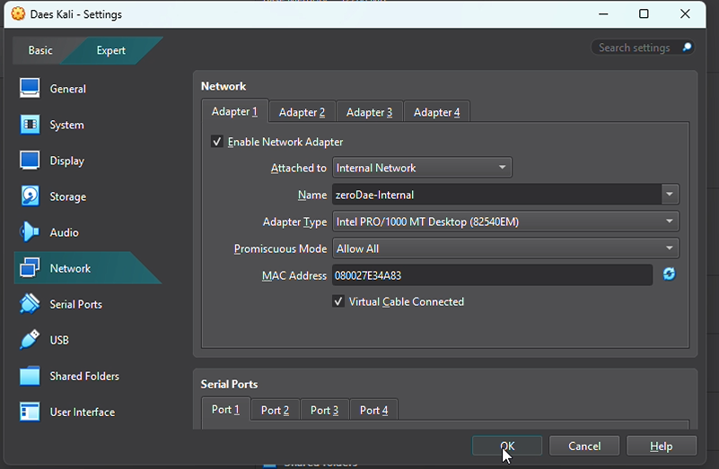	


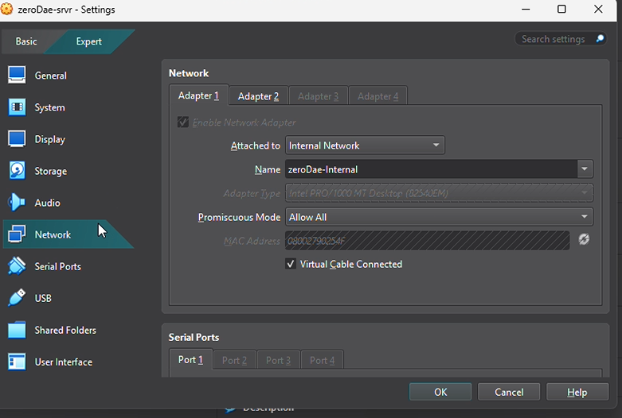


Domain Controller address (from `ipconfig /all`)

```powershell
IPv4 Address. . . . . . . . . . . : 192.168.100.10
Subnet Mask . . . . . . . . . . . : 255.255.255.0
DNS Servers . . . . . . . . . . . : 192.168.100.10
```

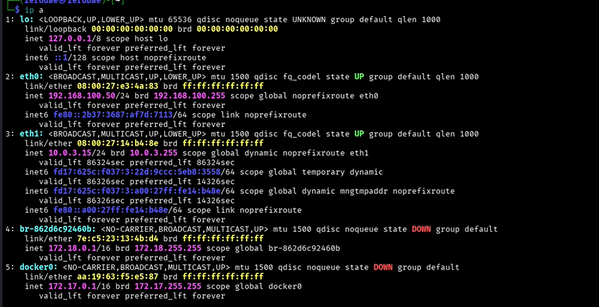


### 2. Domain Controller Health Check 

Verified Active Directory services were healthy before onboarding, using `dcdiag`. All critical tests (Connectivity, Advertising, Replications, NetLogons, Services, KnowsOfRoleHolders) passed

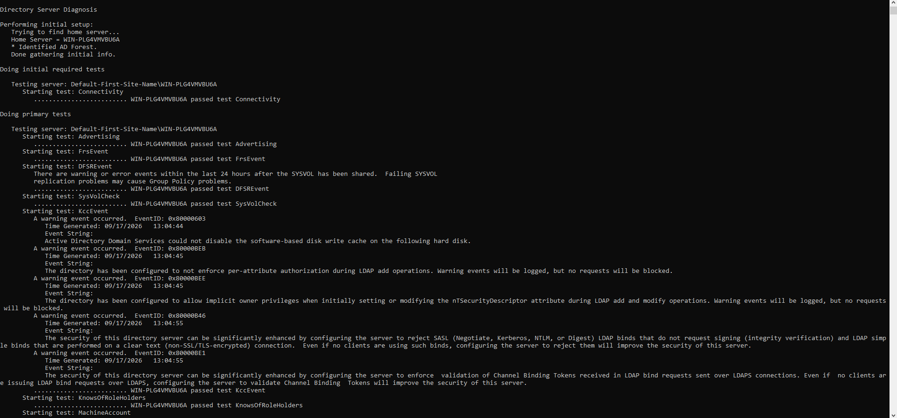


### 3. Onboard the Domain Controller to Azure Arc

Generated the onboarding script in the Azure portal (**Azure Arc → Machines → Add a single server → Generate script**), ran it in an elevated PowerShell session on the DC, and completed the device-login authentication. Azure Arc projects the on-prem server into Azure as a managed resource, which is the prerequisite for installing the Azure Monitor Agent on a non-Azure machine.

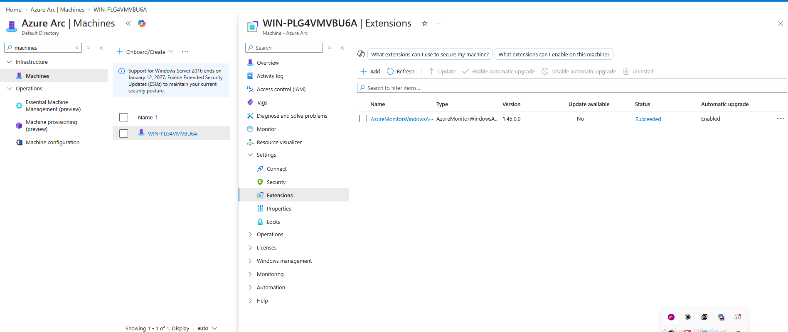


Local confirmation with `azcmagent show`:

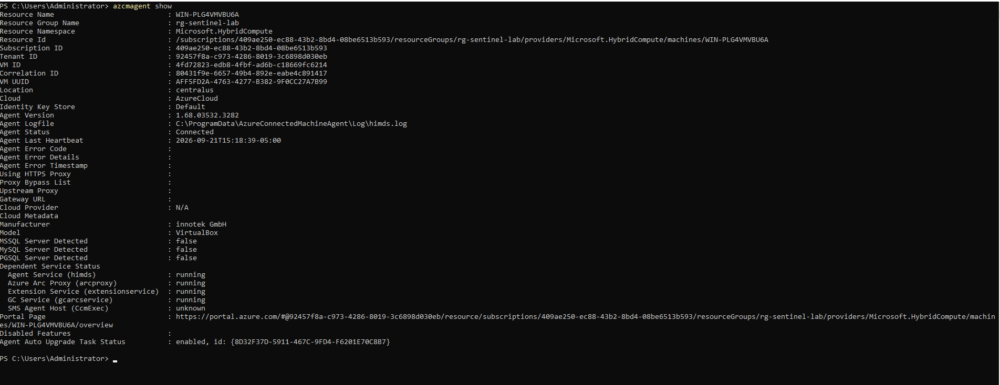
	
```powershell
Resource Name   : WIN-PLG4VMVBU6A
Agent Version   : 1.68.03532.3282
Agent Status    : Connected
```

### 4. Deploy the Azure Monitor Agent + Data Collection Rule

Installed the **Windows Security Events** solution from the Content Hub, opened the **Windows Security Events via AMA** data connector, and created a Data Collection Rule (`dcr-dc-securityevents`) scoped to the Arc-enabled DC, collecting **All Security Events** into the `law-zerodae` workspace. Adding the DC to the DCR automatically installs the Azure Monitor Agent on the box.

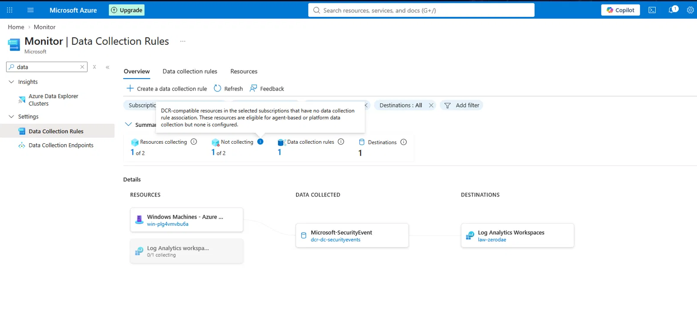


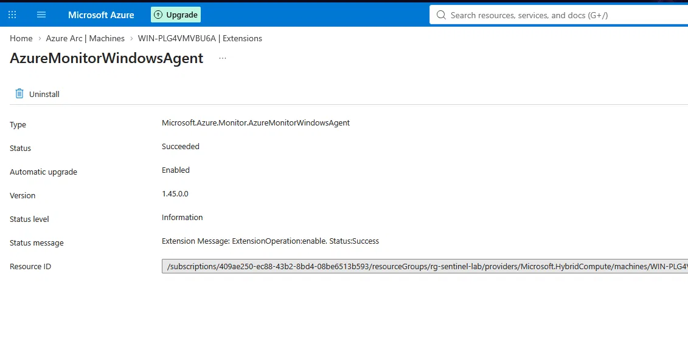


### 5. Enable Auditing (Group Policy)

The DCR only collects events that Windows actually writes to the Security log, so the required audit subcategories must be enabled. Edited the **Default Domain Controllers Policy → Computer Configuration → Policies → Windows Settings → Security Settings → Advanced Audit Policy Configuration → Audit Policies**:

- **Logon/Logoff → Audit Logon** — Success + Failure → _Event IDs 4624 / 4625_
- **Account Logon → Audit Kerberos Service Ticket Operations** — Success + Failure → _Event ID 4769_
- **Account Logon → Audit Kerberos Authentication Service** — Success + Failure → _Event IDs 4768 / 4771_

Applied with `gpupdate /force` on the DC.
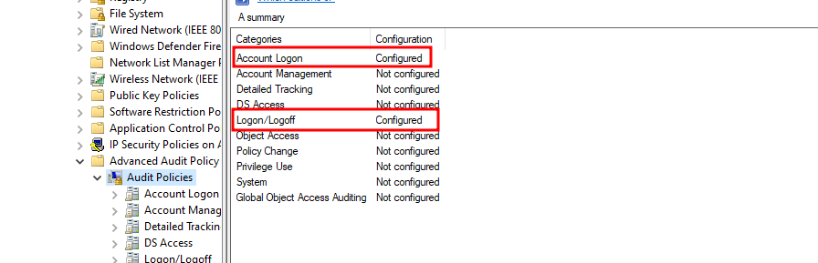
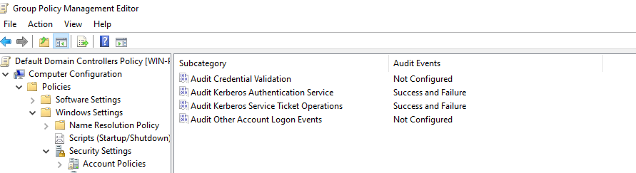
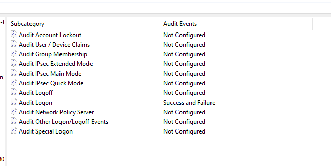
	


### 6. Verify Telemetry Reaching Sentinel

Confirmed events were flowing from the DC into the `SecurityEvent` table, and that the agent was reporting via `Heartbeat`.
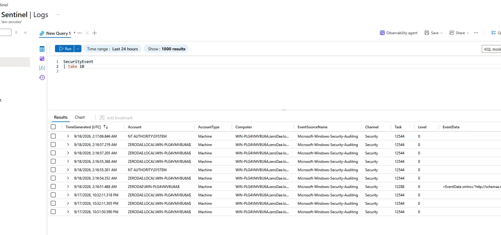


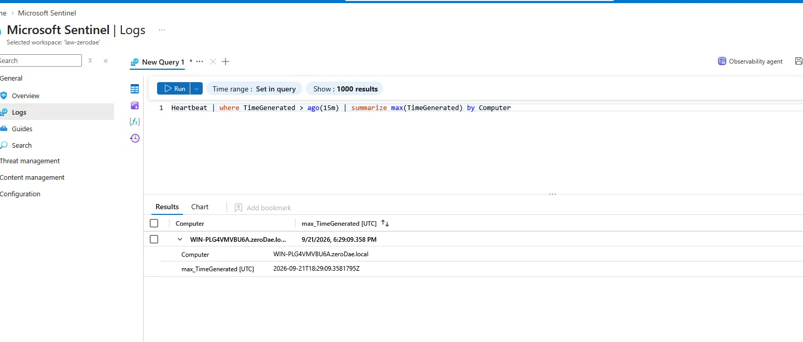


### 7. Attack Simulation — Password Spray (Kali)

Created six disposable domain accounts as targets, then ran a **password spray** with NetExec — one incorrect password tried against all six accounts. Spraying (one password × many users) generates a burst of failed logons from a single source without exceeding the 3-attempt account-lockout threshold on any individual account.

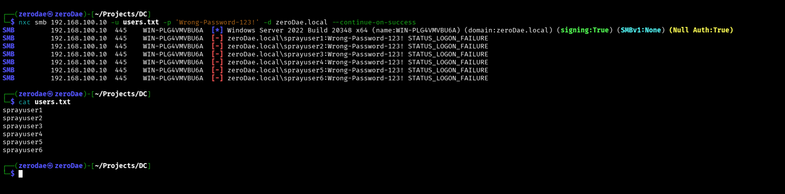


```bash
# Target list
echo -e "sprayuser1\nsprayuser2\nsprayuser3\nsprayuser4\nsprayuser5\nsprayuser6" > users.txt

# Spray one wrong password across all six accounts
nxc smb 192.168.100.10 -u users.txt -p 'Wrong-Password-123!' -d zeroDae.local --continue-on-success
```
### 8. Attack Telemetry in Sentinel

The six failed logons appeared in the `SecurityEvent` table within seconds, each stamped with the attacker's source IP (`192.168.100.50`) and **LogonType 3** (network / SMB) — the fingerprint of a remote credential attack.

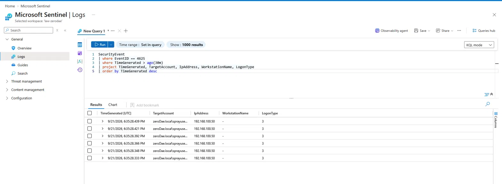
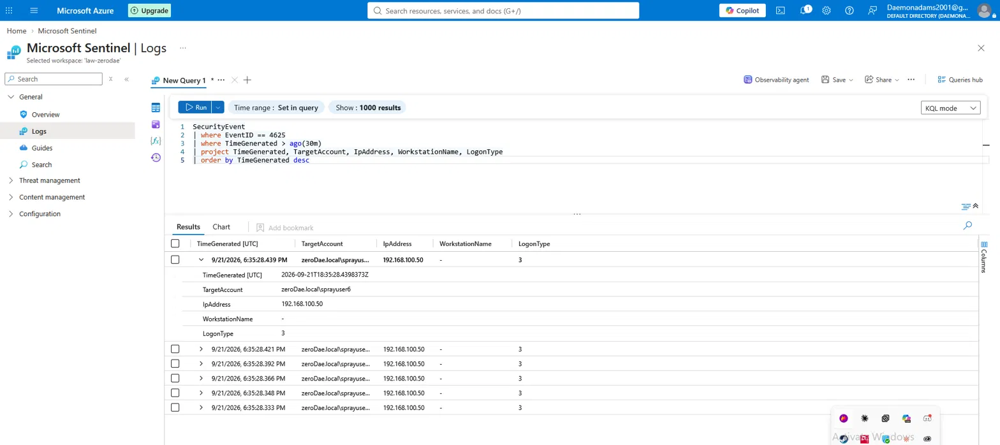
	
```kql
SecurityEvent
| where EventID == 4625
| where TimeGenerated > ago(30m)
| project TimeGenerated, TargetAccount, IpAddress, WorkstationName, LogonType
| order by TimeGenerated desc
```

### 9. Detection Logic (KQL)

Aggregated the failed logons per source IP and thresholded on volume — the core of a brute-force / password-spray detection.
**Result:** a single detection row — `IpAddress 192.168.100.50`, `FailedAttempts 6`, with all six targeted accounts enumerated.

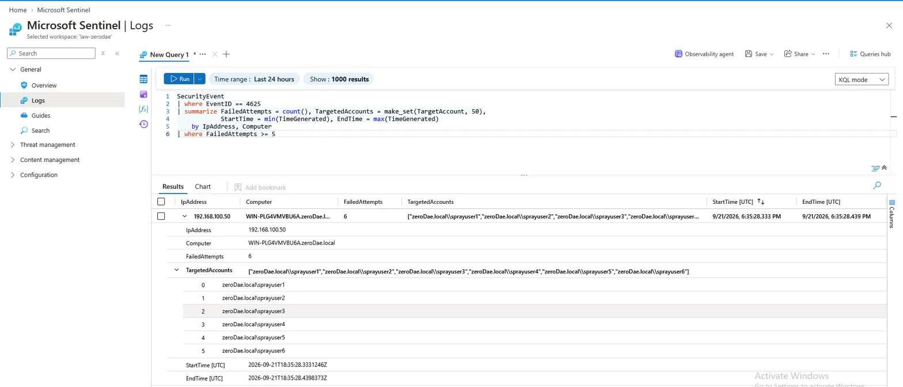

```kql
SecurityEvent
| where EventID == 4625
| summarize FailedAttempts = count(),
            TargetedAccounts = make_set(TargetAccount, 50),
            StartTime = min(TimeGenerated),
            EndTime = max(TimeGenerated)
    by IpAddress, Computer
| where FailedAttempts >= 5
```

### 10. Scheduled Analytics Rule → Incident

Deployed the detection query as a **scheduled analytics rule** in Sentinel so it runs continuously and raises incidents automatically.

| Setting           | Value                                                               |
| ----------------- | ------------------------------------------------------------------- |
| Name              | Brute Force / Password Spray – Multiple Failed Logons (4625)        |
| Severity          | Medium                                                              |
| MITRE ATT&CK      | Credential Access → **T1110.003 (Password Spraying)**               |
| Entity mapping    | IP → `IpAddress` · Account → `TargetedAccounts` · Host → `Computer` |
| Schedule          | Run every 5 minutes · 1-hour lookback                               |
| Incident creation | Enabled (grouped alerts)                                            |
## Skills Demonstrated

- **Hybrid cloud log pipeline** — projecting an on-prem AD DC into a cloud SIEM with Azure Arc + Azure Monitor Agent + Data Collection Rules
- **Detection engineering** — writing and tuning a KQL analytics rule with entity mapping
- **Attack simulation** — password spraying with NetExec against a live domain controller
- **MITRE ATT&CK mapping** — classifying the detection as T1110.003
- **SOC analyst workflow** — the full loop of attack → telemetry → detection → incident
