# Kerberoasting: Attack, Detection & Offline Cracking (Microsoft Sentinel)

**Author:** zeroDae
**Date:** September 2026
**MITRE ATT&CK:** T1558.003 — Credential Access → Kerberoasting

## Objective

Demonstrate the full kerberoasting kill chain against an on-premises Active Directory domain controller and detect it in Microsoft Sentinel: expose a service account with a Service Principal Name (SPN), request its Kerberos service ticket from an attacker host, detect the malicious RC4 ticket request via Event ID 4769, and recover the service account's plaintext password offline.

This builds directly on the on-prem DC → Azure Arc → AMA → Sentinel pipeline established in the previous project; that telemetry path (including the `Audit Kerberos Service Ticket Operations` policy, Event ID 4769) is already live.

## Architecture

```plain text
Kali (attacker) — 192.168.100.50
        │   Kerberoast: LDAP query for SPNs → TGS request (RC4) via Impacket
        ▼
Windows Server 2022 DC — zeroDae.local (192.168.100.10)
        │   Event ID 4769 (Kerberos service ticket requested)
        ▼
Azure Arc + Azure Monitor Agent (AMA)
        │   Data Collection Rule (dcr-dc-securityevents)
        ▼
Log Analytics Workspace — law-zerodae
        ▼
Microsoft Sentinel — KQL analytics rule (0x17 filter) → Incident
```


## Why Kerberoasting Matters

Kerberoasting abuses a legitimate feature of Kerberos rather than a bug: any authenticated domain user can request a service ticket (TGS) for any account that has an SPN. That ticket is encrypted with the service account's password hash, so it can be cracked offline with no further contact with the domain — the cracking is invisible on the wire. It only requires a single valid domain credential, which makes it one of the most common privilege-escalation paths in Active Directory.

**Detection signal:** modern AD uses AES encryption (`0x12` / `0x11`) for Kerberos tickets by default. Attacker tools (Impacket, Rubeus, NetExec) request tickets as **RC4 (`0x17`)** because RC4 is far easier to crack. A 4769 event with **encryption type `0x17`** targeting a **user-account SPN** (not a machine account ending in `$`) is therefore a high-fidelity indicator.


## Environment

| Component | Detail |
|---|---|
| Domain Controller | Windows Server 2022 · `WIN-PLG4VMVBU6A` · domain `zeroDae.local` |
| Attacker | Kali Linux (192.168.100.50, Internal Network) |
| SIEM | Microsoft Sentinel · Log Analytics `law-zerodae` |
| Target | `svc_sql` — user account with SPN `MSSQLSvc/sql.zeroDae.local:1433` |

### Environment Setup

#### 1. Create a Kerberoastable Service Account

An SPN registered to a normal user account with a crackable password *is* the vulnerability:
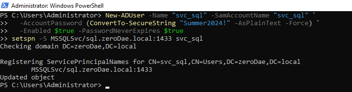

```powershell
New-ADUser -Name "svc_sql" -SamAccountName "svc_sql" `
  -AccountPassword (ConvertTo-SecureString "Summer2024!" -AsPlainText -Force) `
  -Enabled $true -PasswordNeverExpires $true

setspn -S MSSQLSvc/sql.zeroDae.local:1433 svc_sql
```

Confirm the SPN registered:

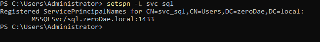

```powershell
setspn -L svc_sql
```


## Attacker POV

The attack chain below demonstrates that once an attacker has valid credentials, they can use them to exploit any vulnerable SPN accounts in the domain.

### Kerberoasting from Kali

- Using a valid domain credential, the attacker can request TGS tickets for the domain's SPN-bearing accounts.
- Impacket queries LDAP for SPN-bearing accounts, requests their tickets (as RC4 by default), and dumps the crackable hashes:
        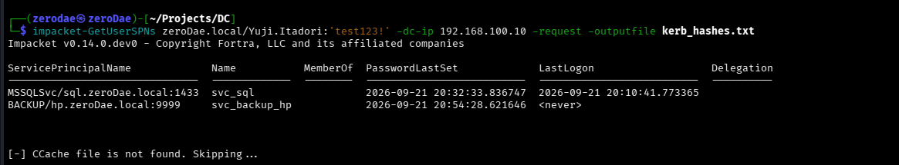

```bash
impacket-GetUserSPNs zeroDae.local/Dae:'passwd' -dc-ip 192.168.100.10 -request -outputfile kerb_hashes.txt
```

- The output includes both `svc_sql` and `svc_backup_hp` (the honeypot account); the attacker now holds each account's `$krb5tgs$23$...` hash (mode 23 = RC4).

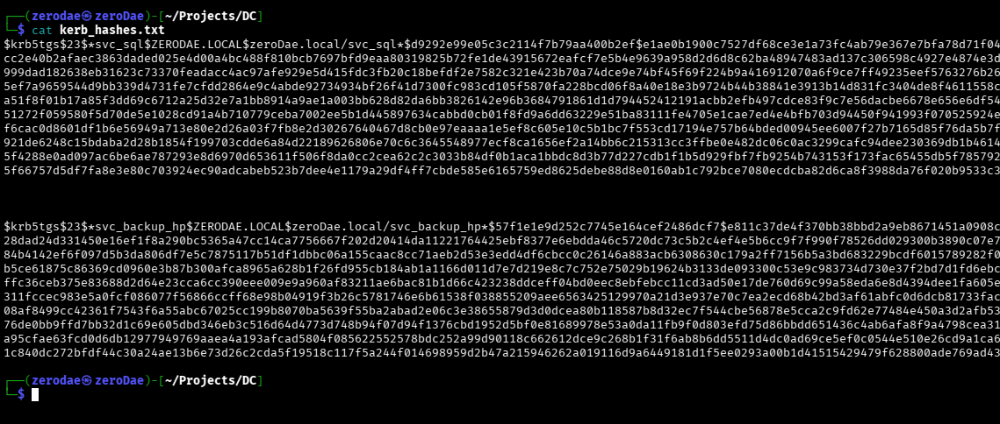

#### Offline Hash Cracking

- Cracking the extracted TGS hash recovers the service account's plaintext password, completing the attack path:

```bash
hashcat -m 13100 kerb_hashes.txt /path/to/wordlist.txt
hashcat -m 13100 kerb_hashes.txt --show     # display recovered plaintext
```

Recovered: `svc_sql : Summer2024!`

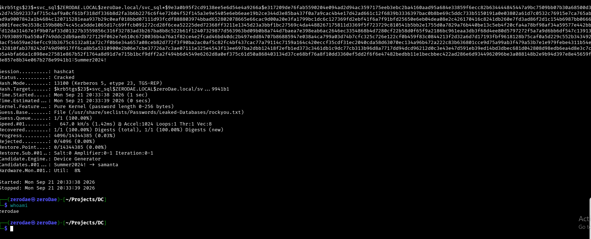


## Detection in Sentinel

- The encryption type is **not** a promoted column in the `SecurityEvent` table — it lives inside the raw `EventData` XML — so it must be parsed out.
- This query extracts the encryption type, service name, and requesting account, then filters for the kerberoast signal:

```kql
SecurityEvent
| where EventID == 4769
| where TimeGenerated > ago(30m)
| extend EncType    = extract(@'"TicketEncryptionType">(0x[0-9a-fA-F]+)<', 1, EventData)
| extend SvcName    = extract(@'"ServiceName">([^<]+)<', 1, EventData)
| extend ReqAccount = extract(@'"TargetUserName">([^<]+)<', 1, EventData)
| where EncType == "0x17"
| where SvcName !endswith "$" and SvcName != "krbtgt"
| project TimeGenerated, ReqAccount, SvcName, EncType, IpAddress
| order by TimeGenerated desc
```

**Results:** both service accounts were detected with the query above. It filters for encryption type `0x17` while excluding the benign `krbtgt` account and machine accounts (those ending in `$`).

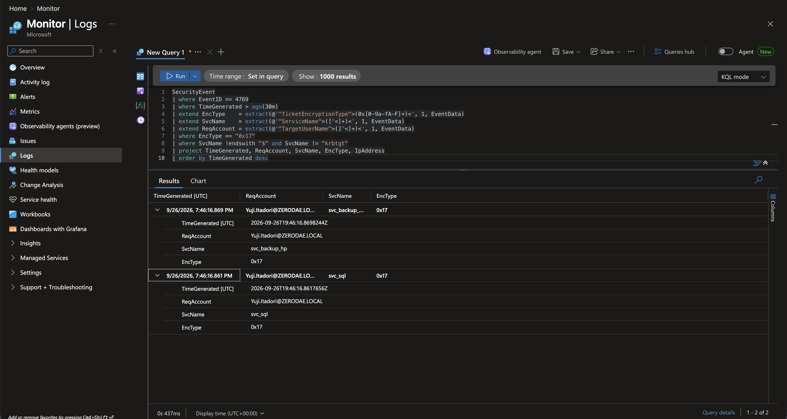

**Analysis note:** in a real intrusion the requestor would be whatever low-privileged account the attacker had compromised — which is why the detection keys on the **service being targeted (`ServiceName`) + RC4**, not on the requestor, so it fires regardless of which account launched it.


## Scheduled Analytics Rule

- Using the same query, I created a scheduled rule so Sentinel autonomously monitors for kerberoasting against **any** user.

| Setting           | Value                                                      |
| ----------------- | ---------------------------------------------------------- |
| Name              | Kerberoasting – RC4 Service Ticket Request (4769 / 0x17)   |
| Severity          | High                                                       |
| MITRE ATT&CK      | Credential Access → **T1558.003 (Kerberoasting)**          |
| Rule logic        | The parsed KQL above                                       |
| Entity mapping    | Account → `SvcName` · Host → `Computer` · IP → `IpAddress` |
| Schedule          | Run every 5 minutes · 1-hour lookback                      |
| Incident creation | Enabled (grouped alerts)                                   |

#### Query Breakdown

```kql
SecurityEvent
| where EventID == 4769
| extend EncType    = extract(@'"TicketEncryptionType">(0x[0-9a-fA-F]+)<', 1, EventData)
| extend SvcName    = extract(@'"ServiceName">([^<]+)<', 1, EventData)
| extend ReqAccount = extract(@'"TargetUserName">([^<]+)<', 1, EventData)
| where EncType == "0x17"
| where SvcName !endswith "$" and SvcName != "krbtgt"
| project TimeGenerated, ReqAccount, SvcName, EncType, IpAddress, Computer
```

- `SecurityEvent` — start with the table holding the DC's Windows security logs.
- `where EventID == 4769` — keep only "a Kerberos service ticket was requested" events (every service-ticket request, normal and malicious).
- `extend EncType = extract(...)` — pull the encryption type (e.g. `0x17`) out of the raw `EventData` XML into its own column.
- `extend SvcName = extract(...)` — pull the service account name out of the XML into its own column.
- `extend ReqAccount = extract(...)` — pull the account that requested the ticket into its own column.
- `where EncType == "0x17"` — filters for only RC4-encrypted requests. Attacker tools typically force weak RC4 because it cracks offline easily, which makes RC4 the red flag.
- `where SvcName !endswith "$" and SvcName != "krbtgt"` — drops computer accounts and the built-in `krbtgt` account to block out false positives. These are normal Kerberos noise.
- `project TimeGenerated, ReqAccount, SvcName, EncType, IpAddress` — show only the columns that matter, instead of the full raw event.

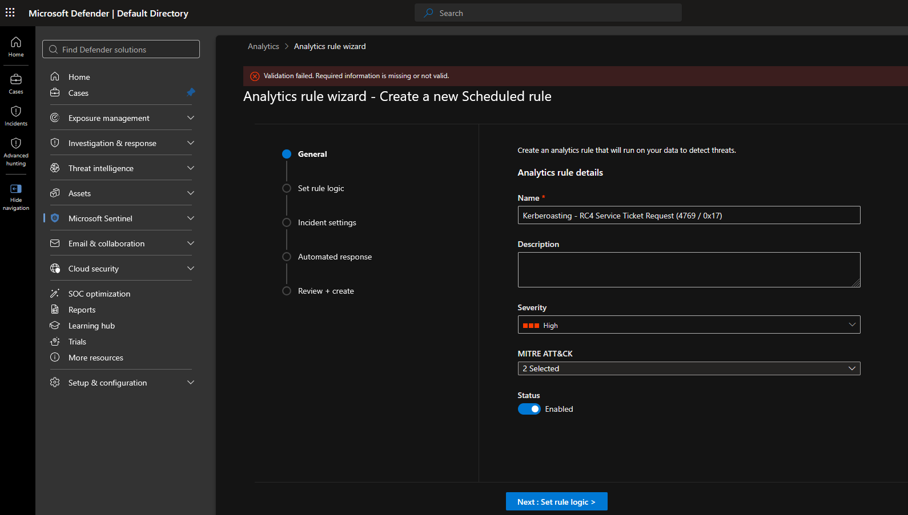

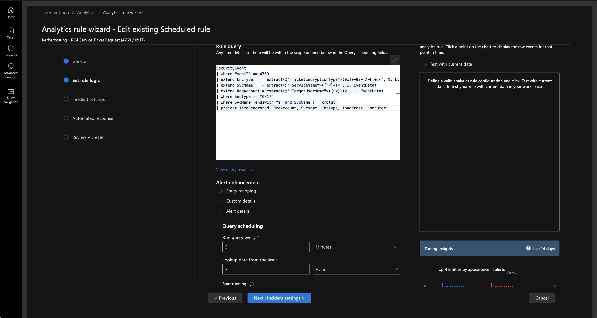

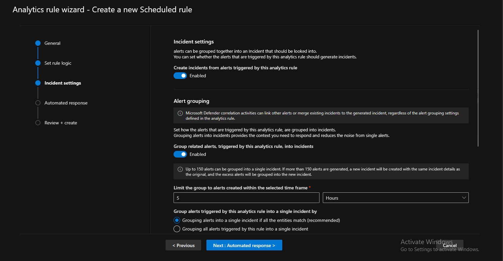

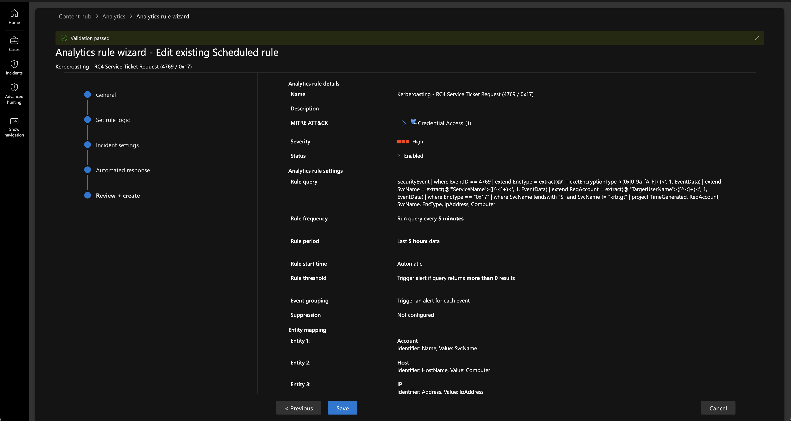

#### Incident Feedback

- The alert reported both targeted accounts.

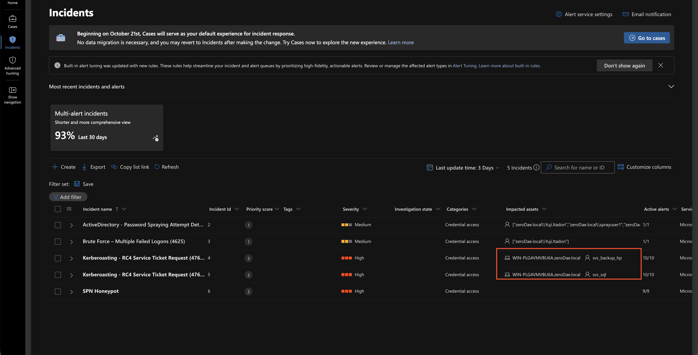

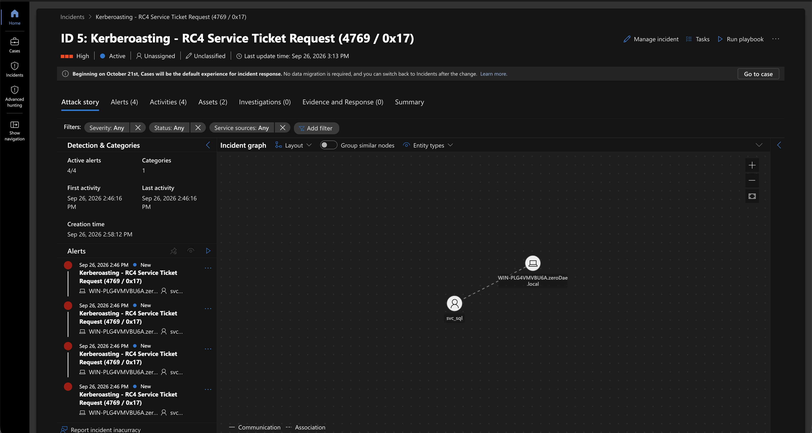


## Detection Countermeasure — SPN Honeypot

A decoy account with an SPN for a non-existent service, created to lure attackers. This rule is specific to that account and alerts the SOC team on any request for it. No legitimate client ever requests it, so **any** 4769 for its SPN is malicious — a zero-false-positive detection.

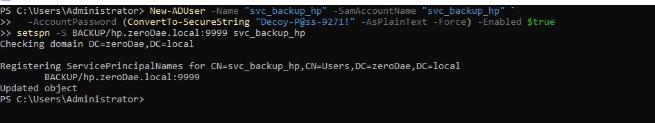

```powershell
New-ADUser -Name "svc_backup_hp" -SamAccountName "svc_backup_hp" `
  -AccountPassword (ConvertTo-SecureString "Decoy-P@ss-9271!" -AsPlainText -Force) -Enabled $true
setspn -S BACKUP/hp.zeroDae.local:9999 svc_backup_hp
```

## Scheduled Rule — SPN Honeypot

| Setting           | Value                                                      |
| ----------------- | ---------------------------------------------------------- |
| Name              | SPN Honeypot                                               |
| Severity          | Critical                                                   |
| MITRE ATT&CK      | Credential Access → **T1558.003 (Kerberoasting)**          |
| Rule logic        | The parsed KQL below                                       |
| Entity mapping    | Account → `SvcName` · Host → `Computer` · IP → `IpAddress` |
| Schedule          | Run every 5 minutes · 1-hour lookback                      |
| Incident creation | Enabled (grouped alerts)                                   |

#### Query Breakdown

```kql
SecurityEvent
| where EventID == 4769
| extend SvcName = extract(@'"ServiceName">([^<]+)<', 1, EventData)
| where SvcName == "svc_backup_hp"
```

- `SecurityEvent` — start with the table holding the DC's Windows security logs.
- `where EventID == 4769` — keep only "a Kerberos service ticket was requested" events (every service-ticket request, normal and malicious).
- `extend SvcName = extract(...)` — pull the service account name out of the XML into its own column.
- `where SvcName == "svc_backup_hp"` — filters for only this specific decoy account.

Companion analytics rule (Severity: **Critical**):

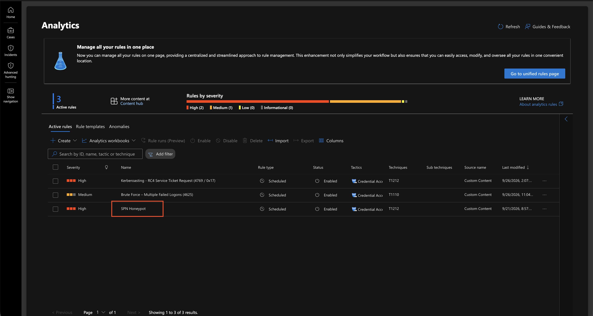

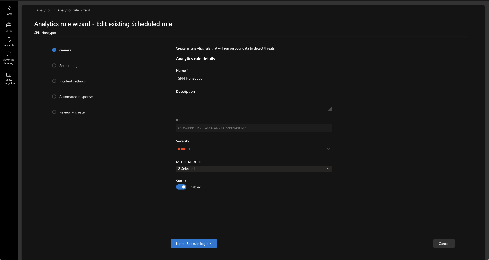

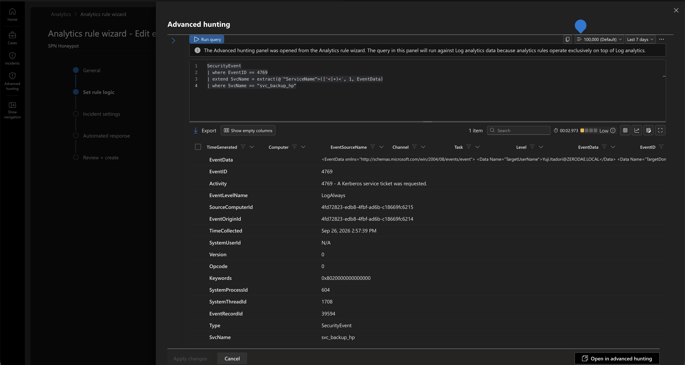

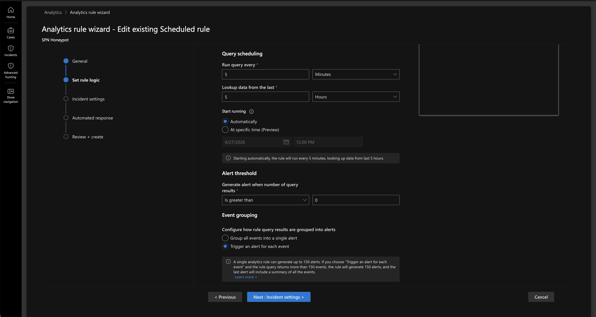

#### Incident Feedback

- Performing the attack in the example above also triggered the SPN honeypot rule, visible in the Incident tab.

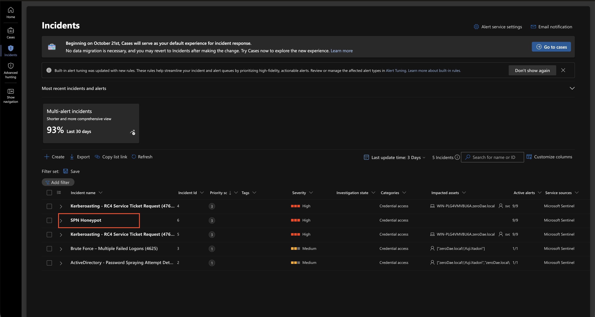

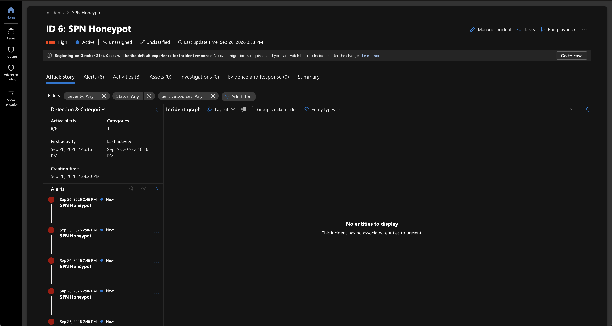


## Detection Tuning Note

The `0x17` filter is high-fidelity in an AES-default environment, but some legacy applications legitimately use RC4 — so in production this rule would be paired with **volume-anomaly detection** (one account requesting many distinct SPNs in a short window) and the **SPN honeypot** above to keep false positives near zero.


## Skills Demonstrated

- **Offensive AD** — kerberoasting a live domain controller with Impacket (T1558.003)
- **Detection engineering** — parsing raw `EventData` XML in KQL to extract a field not promoted to a column, and building a high-fidelity, tuned analytics rule
- **Detection-as-code thinking** — designing an SPN honeypot for zero-false-positive coverage
- **Full attack lifecycle** — SPN exposure → ticket request → SIEM detection → offline crack → recovered credential
- **Honest reporting** — distinguishing what the crack proves (mechanism) from what it doesn't (guessability)


